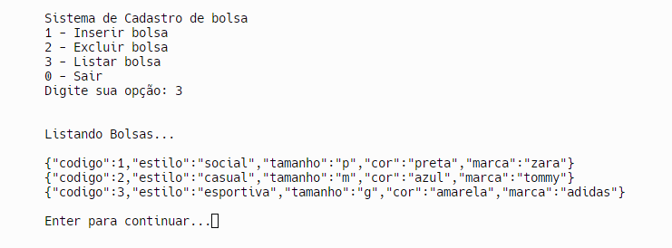
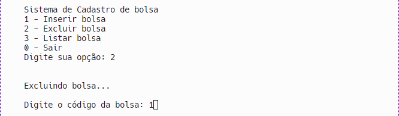
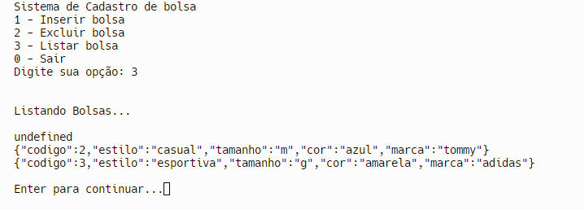

## Instituto Federal do Espírito Santo

# Sandra-F-JavaScript-Pratica-da-Semana-5
# https://github.com/mjpfelicia

                 Welcome! 👋
                 

## Índice

- Desafio
- Links
- Tecnologias usadas
- O que eu aprendi
- Recursos úteis
- Desafio

## Links usados:

- https://youtu.be/xaR4VUq1ih8?si=aFa3J1AVf9emZ6M-
- https://developer.mozilla.org/en-US/docs/Web/JavaScript/Reference/Global_Objects/Function

## Tecnologias usadas:
- Javascript

## O que eu aprendi

1. function inserir: esta função deve receber como parâmetro um objeto relacionado ao tema escolhido. O corpo da função deve apenas adicionar este novo elemento ao array. A função não irá retornar valor.

2.	function excluir: esta função deve receber o código como parâmetro. O corpo da função irá localizar o cadastro com o respectivo código no array e removê-lo. A função não irá retornar valor.

3.	function listar: esta função não deverá receber parâmetro. O corpo da função irá percorrer o array e imprimir todos os cadastros. A função não irá retornar valor.

## Autor
- @mjpfelicia